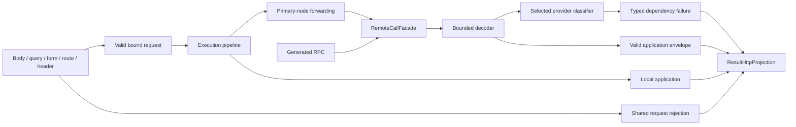

# API and Service-Call Outcomes

Status: implemented, 2026-09-15; numeric status migration completed 2026-09-17.

This design unifies request rejection, HTTP result presentation, generated RPC, and FIPS primary-node forwarding. A valid remote application failure remains an application result. Transport failures and invalid responses become small, typed dependency errors.

The implementation incorporates Monica's request-binding fix at `71a816f4` and the earlier service-call investigation. The important additional correction is strict handling of supplied invalid query, form, route, and header values before the execution pipeline can forward or execute them.

## 1. Compatibility boundary

The synthetic statuses 451/452/453/460 have been **removed**. `ResStatus` is now the closed whitelist of supported transport outcomes and every defined value maps one-to-one to its HTTP status:

| Result status | HTTP status | Meaning |
|---|---:|---|
| 200 | 200 | Successful operation |
| 201 | 201 | Resource created; data may be absent |
| 400 | 400 | Invalid request or failed validation (`request.invalid`, `validation.failed`) |
| 401 | 401 | Authentication required; token expiry uses `auth.access_token_expired` / `auth.refresh_token_expired` |
| 409 | 409 | Confirmation required (`operation.confirmation_required`) or state conflict |
| 429/502/503/504 | 429/502/503/504 | Rate limiting and dependency outcomes |

Producers set typed reason codes (`ResultErrorCodes`) alongside the standard status; the presentation layer fills `auth.unauthorized`/`auth.forbidden`/`internal.unexpected`/`operation.failed` only when a failure arrives without one. Unsupported media and oversized requests retain 415 and 413. A result status outside the whitelist — including the removed 451/452/453/460 numbers — is a local contract defect and a remote protocol violation.

The host's frozen JSON configuration remains authoritative. FIPS keeps its `code` alias. Status agreement means **exact** agreement: the envelope status equals the HTTP status.

## 2. Responsibilities



| Owner | Responsibility |
|---|---|
| `Monica.Core.Results` | Envelope, typed public errors, reason codes, trace fallback, public presentation, HTTP mapping |
| `Monica.Core.ExceptionHandling` | Shared request rejection and the host exception boundary |
| `Monica.WebApi` | MVC adapters, OpenAPI projection, complete HTTP call lifetime and decoding |
| `Monica.Dapr` | Dapr transport registration and recognition of structured Dapr errors |
| FIPS `Platform.Infrastructure` | Chinese message policy, logical service identities, primary-node routing |
| Generated clients | Construct the declared request and delegate one call |

Internal decoding helpers throw classified exceptions. Only the result boundary translates recognized remote failures into a result. Local configuration, serialization, and programming defects propagate to the normal host exception handler.

There is no retry engine, payload snapshot framework, or new general RPC protocol.

## 3. One public error contract

The reserved `metadata.error` member contains only `ResultError`:

```json
{
  "code": 400,
  "message": "Check the request field when.",
  "metadata": {
    "error": {
      "code": "request.invalid",
      "traceId": "0123456789abcdef0123456789abcdef",
      "fields": [
        {
          "path": "when",
          "code": "invalid_date_time",
          "message": "Enter a date and time, for example 2026-09-15 14:30:00."
        }
      ]
    }
  }
}
```

- `code`: stable machine-readable reason; callers never parse message prose.
- `traceId`: required nonempty origin correlation identifier.
- `service`: optional logical service name, never an app ID or address.
- `operation`: optional logical operation name.
- `fields`: optional immutable field errors expressed in the originating request contract.

`ResultError` validates its required members and copies its field collection. Use `SetError` to replace the reserved member. Do not use `AppendMetadata("error", ...)`, arbitrary anonymous errors, exception objects, or numbered error variants.

HTTP and remote presentation preserve declared application data and public metadata. They remove the reserved diagnostic keys `originResponse`, `request`, `response`, `deserializationError`, `exception`, `detail`, `chain`, `chain_error`, and `remoteService`, including numbered variants. A deserialized typed error is projected back through the public model so undeclared technical members do not survive.

This policy does not recursively sanitize arbitrary business data or public application metadata. Producers remain responsible for what they declare public. `WithDetail` is an in-process helper and is removed at these boundaries.

An existing legacy `metadata.error` is a contract violation: a local producer causes a local exception; an incoming remote producer causes `dependency.invalid_response`. There is no compatibility converter that hides mixed deployments.

## 4. Trace and message policy

An active W3C trace is reused. Without one, HTTP boundaries derive a stable identifier from `HttpContext.TraceIdentifier`. The remote boundary starts an activity even when there are no listeners, captures the trace once, and reuses it in its result and diagnostic event. A standalone worker can call `ResultTraceId.Capture()` once and retain the result for the same purpose.

A valid incoming error keeps its origin trace and reason across hops. The receiving boundary does not relabel a domain failure as a dependency failure.

`IResultErrorMessageProvider` supplies missing public messages. FIPS maps logical domains to their existing Chinese descriptions and gives timeout messages that acknowledge an unknown execution outcome. Declared safe application messages are retained. Unexpected exception text and provider prose are never used as fallback public messages.

Operator logs always carry the full exception object. `ModuleResultEnvelopeOption.ExposeDiagnosticDetails` is the single host diagnostic switch: enabled hosts produce bounded `metadata.exception` details for unhandled exceptions, keep reserved members (`exception`, `detail`, `chain`, `chain_error`, `remoteService`) in HTTP responses, forward a downstream's reserved details across remote calls instead of stripping them, and attach the call chain — including SQL text and parameter values recorded by the EF command interceptor — to result envelopes. It may be enabled on any host whose consumers may see that material, including production. A forwarded application failure that does not identify its origin additionally gains the immediate dependency's `service`/`operation` on its typed error so clients can show where the failure came from. Hosts that keep the switch off behave exactly as before: reserved diagnostics are stripped locally and never cross service boundaries. FIPS enables the switch explicitly instead of relying on defaults.

The call chain is the debugging channel for hosts without distributed-tracing infrastructure, so remote-call nodes correlate every outcome: the remote-call boundary stamps the envelope with the target service identity (`metadata.remoteService`, for example the Dapr app id, stamped on decoded responses and classified transport failures alike), and the chain node records it together with the downstream's correlation trace id (`remoteTraceId`, resolved from the downstream's `metadata.traceId` or its typed error) for successful and failed calls alike; failed calls additionally keep the error's `code`/`service`/`operation`. The chain root carries the recording host's own service identity when `ModuleChainTracingOption.ServiceName` is configured, so a forwarded response that aggregates several chains (the local chain plus a forwarded `chain`) stays self-describing.

Responses built from unhandled exceptions expose the same correlation members through `IExceptionResponseDiagnostics`: the chain-tracing module implements it, recovering the request chain from `HttpContext` items — AsyncLocal mutations made downstream do not flow back to the exception handler when the pipeline unwinds — so an exception response carries `metadata.traceId` and, on diagnostic hosts, the full chain including the failing node with its exception. The actor-invocation tracing node records the observed outcome instead of an unconditional success: a propagated exception, or the HTTP status the actor runtime produced.

A classified dependency failure emits one structured warning containing reason, logical service and operation, route template, stage, transport, upstream HTTP status, validated `Retry-After`, duration, exception type, and trace. It excludes resolved addresses, query values, bodies, and headers. Dedicated RPC clients disable the standard HTTP loggers so those loggers do not reintroduce raw URLs.

## 5. Request rejection before execution

`IRequestRejectionFactory` is shared by the MVC ModelState adapter, bad-request exception mapper, and validation exception mapper.

- Invalid supplied body, query, form, route, and header values stop action and proxy execution.
- Missing optional values keep their declared defaults.
- Existing request-source selection and route-overlay behavior remain intact.
- Formatter exceptions do not contribute their raw messages or attempted values.
- Declared property metadata maps field paths to canonical JSON names.
- Field output is limited to 32 entries, 256 characters per path, and 256 per message.
- Date/time binding failures receive a stable reason and safe example.
- Declaration-owned validation messages remain public, subject to the bounds.

The MVC rejection filter runs before Monica's execution filter. The result filter runs early enough to preserve typed 413/415 responses before the standard API client-error conversion.

For Minimal APIs, the `IProblemDetailsWriter` adapter applies only to Monica-marked Minimal endpoints and only to validation problem details. Unrelated endpoints keep their own ProblemDetails responses.

ASP.NET routing can synthesize an empty 415 endpoint without the original endpoint metadata. The existing narrow empty-413/415 status-code-pages policy remains host-wide for that reason; it is not gated on the missing marker.

## 6. Remote-call lifetime and classification

`IRemoteCallClient.InvokeAsync<TResponse>` accepts a **borrowed** `HttpClient` and an asynchronous request factory.

1. Capture correlation and start the complete-call deadline.
2. Invoke the factory once. Its successful return transfers request ownership.
3. Send once using `ResponseHeadersRead`.
4. Read and decode the body under the same cancellation/deadline token.
5. Validate the canonical envelope and mapped HTTP status.
6. Preserve a valid application result, or classify provider/transport evidence.
7. Dispose the owned request, response, and body streams on every completed path.

The factory must dispose partial objects if construction fails. Generated clients and FIPS adapters do so. Forwarded ASP.NET input streams remain borrowed and open when the outbound content is disposed.

### Timeout ownership

`ModuleRpcClientOption.CallTimeout` defaults to 60 seconds and covers request creation, sending, and body reading. The decoded body limit defaults to 16 MiB.

Only named clients registered by `ModuleRpcClient` under `Monica.Rpc.{appId}` have `Timeout.InfiniteTimeSpan`. Provider/custom configuration is applied before that owned-client setting. A supplied client is never mutated; its shorter send timeout can still expire first. A caller cancellation is propagated as cancellation, including races with the internal deadline.

FIPS configures the complete deadline from `DaprOptions.InvocationTimeout`. Its keyed primary-node clients and DataComparison clients retain their own existing finite timeout.

FIPS Aspire installs a global resilience handler with a retry and a longer timeout. FIPS removes `ResilienceHandler` instances from dedicated RPC clients so commands do not inherit that replay policy. Borrowed clients remain the caller's responsibility. Checked-in Dapr resiliency configuration contains binding retries; service-invocation retries were not declared there. Deployed sidecar/gateway policies still require rollout verification.

### Decoder

Only UTF-8 JSON media types (`application/json` and `+json`) are accepted. gzip, deflate, and Brotli are decoded before applying the byte limit. The JSON document is parsed once and deserialized with the host's canonical options.

The canonical status and message members must each appear once. Status must be a defined nonzero numeric value; message must be a string or null. Payloads must deserialize to the declared type, and any existing reserved error must satisfy the typed contract.

A valid envelope takes precedence over provider classification, including a valid application 500. A contradictory envelope never becomes success. Dapr classification is enabled by explicit transport selection and recognizes structured `ERR_DIRECT_INVOKE`; English error text is not evidence.

### Failure matrix

These rules apply when no valid application envelope was accepted:

| Evidence | Result / HTTP | Reason |
|---|---:|---|
| Network send failure, HTTP 503, recognized Dapr direct-invoke failure | 503 | `dependency.unavailable` |
| HTTP 429 | 503 | `dependency.rate_limited` |
| Complete deadline, known client send timeout, HTTP 408/504 | 504 | `dependency.timeout` |
| Invalid envelope, contradictory HTTP status, invalid successful response, excessive successful body | 502 | `dependency.invalid_response` |
| Other unrecognized HTTP 4xx | 502 | `dependency.rejected` |
| Other unrecognized HTTP 5xx | 502 | `dependency.failed` |
| Caller cancellation | Propagated | No synthetic result |
| Local configuration/request serialization defect | Propagated | Normal local exception boundary |

A meaningful non-success HTTP status remains available when its body is unreadable. A contradictory apparent envelope is always a protocol failure. A valid application 429 remains 429, with its application error preserved.

For downstream throttling, `Retry-After` is parsed as an HTTP delay/date and bounded to 128 characters in diagnostics. It is not an automatic retry promise, public metadata field, or forwarded response header. The distinct reason preserves the rate-limit signal even though the outward dependency status is 503.

## 7. Consumer migration and IsOk audit

Migrated consumers:

- Generated HTTP RPC implementations.
- FIPS mediated primary-node forwarding.
- FIPS direct CRUD/MVC primary-node forwarding.
- FIPS DataComparison's separate primary-node client.

Both forwarding behaviors return the shared result and never execute locally after a forwarding failure. They use `ResultHttpProjection` for HTTP presentation. Routing, proxy-decision retention, source headers, and self-host decisions remain application-owned.

Removed obsolete consumers/providers include `IResultEnvelopeReader`, the old response-reader extensions and capture models, and the unused service-invocation connector modules. Actor transport is not redesigned; tracing no longer buffers or rewrites actor response bodies to attach chain graphs.

`IsOk` now recognizes 200 and 201. It checks status, not payload presence. Declare nullable payloads where absence is allowed, and explicitly guard remote data before dereferencing it.

The production `IsOk(out ...)` audit found:

| Call sites | Finding / action |
|---|---|
| FlightRoute `CommandHandlerGenFlightRoute`, `CommandHandlerMatchFlightRoute` | Added empty-data/empty-flight guards after the RPC status check |
| GeneralFlight `GaPlanAppService` | Existing explicit null check retained |
| Monica StateStore UI's three consumers | Local key-loading producer returns a populated success or failure; no Created producer |
| FlightRoute route splitting, point/sector lookup, repository boolean checks | Local producers return populated 200 results; existing empty-collection/value checks retained |
| Alarm processing | Repository uses `OkOrFailWhenNull`; success has a payload |
| GeneralFlight external ICE handshake | Explicit 201 status comparison retained; this third-party protocol is outside the Monica decoder |

No first-party Created producer was introduced. Regression tests explicitly accept 200/201 with null data; consumers must not infer data availability from numeric success.

## 8. Rollout acceptance

The unit of rollout is a mutually calling service cohort, including shared libraries, generated clients, proxy adapters, and custom callers.

- [x] Remove the synthetic 451/452/453/460 statuses; producers emit standard statuses with typed reason codes and off-whitelist numbers are contract defects.
- [x] Use one typed error producer at every migrated framework boundary.
- [x] Remove first-party references to the obsolete reader/connector path.
- [x] Verify strict rejection before action/proxy execution and valid optional defaults.
- [x] Verify application 500 preservation, aliases, custom envelopes, status mismatch, bounded decompression, body timeout, caller cancellation, disposal, and single sending.
- [x] Verify worker correlation and diagnostic-only Retry-After.
- [x] Verify only owned clients get infinite timeout; provider classification is transport-specific and follows valid-envelope recognition.
- [x] Expose canonical aliases and the typed error schema in OpenAPI.
- [ ] Validate the target Aspire/deployment environment end to end, including its actual retry policies.
- [ ] Confirm **no deployment unit contains both legacy and typed `metadata.error` producers**, including plugins and independently built consumers.

The final two checks are deployment acceptance, not grounds for a compatibility adapter. Do not roll this error-contract change through a mixed cohort. Numeric migration remains a separate frontend-coordinated change.

Build/test evidence and local environment checks are recorded in the [validation report](service-call-outcomes-validation.md). FIPS's existing build warnings are separate from Monica's zero-warning requirement.

## 9. Reference evidence

- Exact Dapr.Client 1.18.4 package commit: [InvocationHandler.cs](https://github.com/dapr/dotnet-sdk/blob/386b0ed7487ea365341f0ac52c4ba4df3593b635/src/Dapr.Client/InvocationHandler.cs). The handler rewrites the invocation URI and delegates to HTTP; it does not create a Monica error result.
- [HttpCompletionOption](https://learn.microsoft.com/en-us/dotnet/api/system.net.http.httpcompletionoption): `ResponseHeadersRead` requires separate attention to body timeout and size.
- [ASP.NET Core API validation](https://learn.microsoft.com/en-us/aspnet/core/web-api/?view=aspnetcore-10.0#automatic-http-400-responses): API-controller ModelState rejection occurs before action execution.
- [Minimal API validation](https://learn.microsoft.com/en-us/aspnet/core/fundamentals/minimal-apis?view=aspnetcore-10.0#validation-support-in-minimal-apis): validation uses the problem-details service.
- [Dapr invocation API](https://docs.dapr.io/reference/api/service_invocation_api/), [Dapr error codes](https://docs.dapr.io/developing-applications/error-codes/error-codes-reference/).
